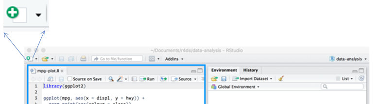

```{r setup, include=FALSE}
knitr::opts_chunk$set(echo = FALSE)
```

## What is R Markdown? 

R Markdown allows you to combine:

- Code
- Results 
- Prose

in a fully reproducible document.

> Supports Word, PDF, Slide outputs


## Why use R Markdown?

1. To communicate to decision makers.

2. To collaborate with other analysts.

3. To capture what you were thinking as well as what you did.


## When use R Markdown?
As a rough guide:


> When more code than text: ***R script***

> When more text than code: ***R Markdown***


## Overview

1. Metadata (heading)

2. Text

3. Code (R, SQL, Python ...)


## It looks like this:


## It looks like this:


## YAML (Metadata or header)

- Controls document settings

- Not important for now. 

- Title, author, date 

## Start a new R Markdown document (or R Notebook) | ...but...



## Please open the tutorial:

> **intro_rmarkdown.rmd**

## More in your new bible | <http://r4ds.had.co.nz>
 


## *Even* more in the R Markdown book | <http://bookdown.org/yihui/rmarkdown>
 

## Licence

This material was created for the NHS-R community by: 
Andrew Jones at The Strategy Unit

The work is licenced under:
Creative Commons
Attribution-ShareAlike 4.0
International

To view a copy of this license, visit
<https://creativecommons.org/licenses/by-sa/4.0/>
